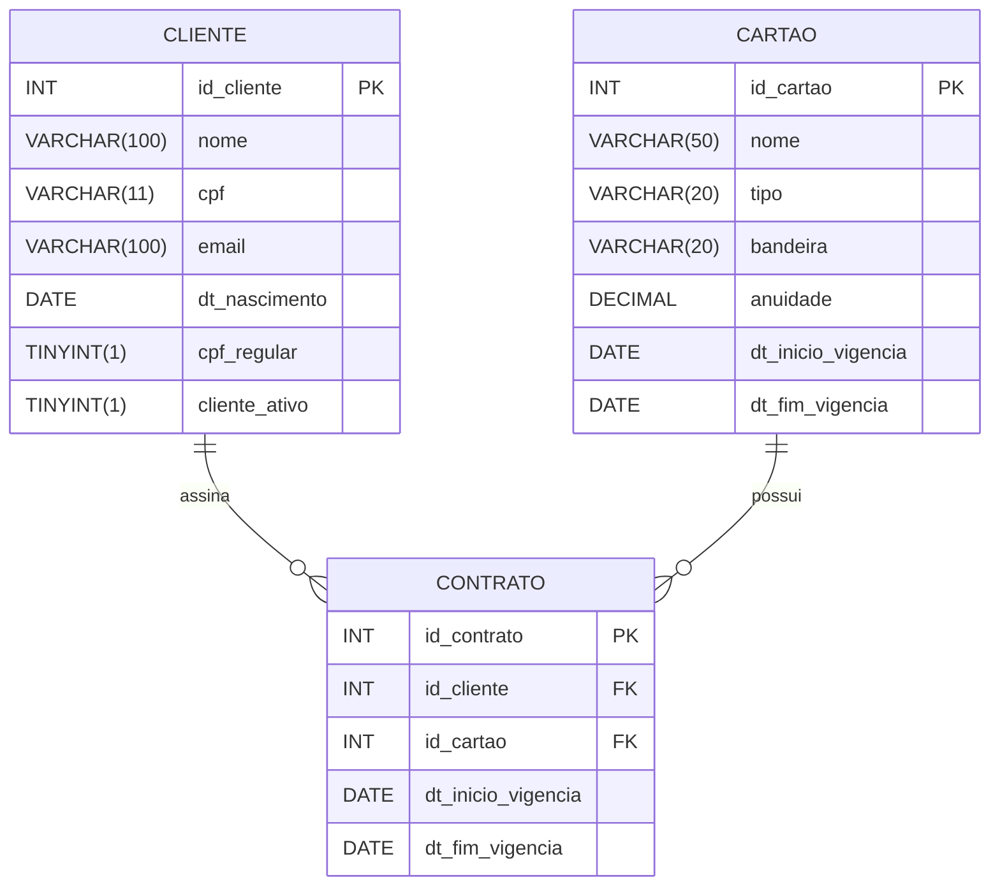

# 👨‍💻 Tech Challenge

Neste Tech Challenge fomos desafiados a criar um sistema que gerencie cartões, clientes e contratos.

## ✅ Tecnologias utilizadas

Para desenvolver esse sistema utilizamos as seguintes tecnologias:

### 🎨 Front-end

- HTML
- CSS
- JavaScript
- Tailwind

### 👾 Back-end

- MySQL
- NodejS
- Express
- EJS

## 🏗️ Arquitetura de software

O projeto segue os princípios de **Model View Controller (MVC)** com separação clara entre camadas:

- **Model (Modelo)**: Representa os dados da aplicação e a lógica de negócios, interagindo com o banco de dados e outras fontes de dados.

- **View (Visão)**: É responsável pela apresentação dos dados ao usuário, exibindo a interface e recebendo as interações do usuário.

- **Controller (Controlador)**: Atua como intermediário entre o Model e a View, recebendo as solicitações do usuário (via View), processando-as no Model e atualizando a View com os resultados.

### 📂 Estrutura do repositório

A organização do repositório refleta a arquitetura escolhida.

```
.
├── public                      # Arquivos compartilhados para todas as páginas
└── src                         #
    ├── config                  #
    ├── controllers             #
    ├── models                  #
    ├── routes                  #
    └── views                   # Telas
        ├── cartoes             # Telas para páginas de cartões
        ├── clientes            # Telas para páginas de clientes
        ├── contratos           # Telas para páginas de contratos
        └── partials            # Fragmentos de telas utilizados nas demais páginas
```

## 💾 Modelos de dados



## 🔧 Instalação e Configuração

1. Instale as dependências:

```bash
    npm install
```

2. Execute o comando para subir a aplicação:

```bash
    npm run dev
```

## 📚 Documentação da API

A documentação Swagger estará disponível em:

```
http://localhost:3000/api/docs
```

## 📲 Endpoints Disponíveis

### Clientes (`/api/v1/users`)

- `POST /` - Criar usuário
- `GET /` - Listar usuários (com paginação)
- `GET /:id` - Buscar usuário por ID
- `PATCH /:id` - Atualizar usuário
- `DELETE /:id` - Remover usuário
