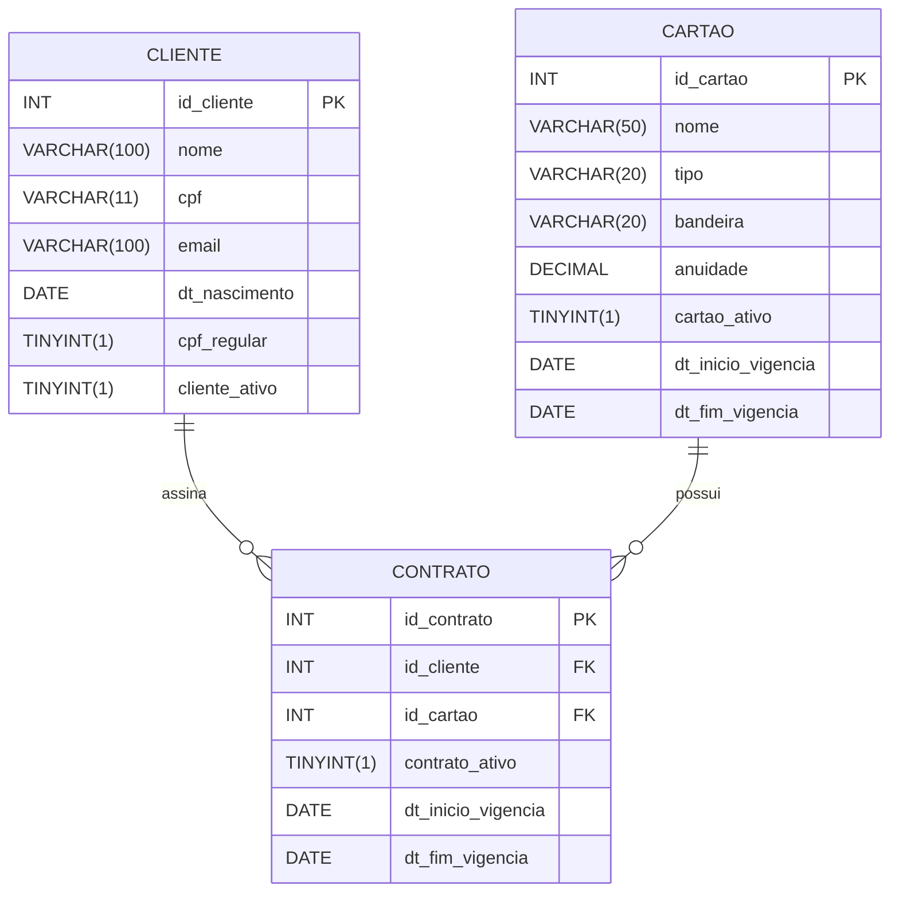

# Tech Challenge

Este Tech Challenge teve como objetivo desenvolver um sistema para gerenciamento de cartões, clientes e contratos. A aplicação inclui uma API REST e uma interface gráfica, permitindo que administradores acessem e gerenciem o sistema de forma prática.

## Sumário

- [Tech Challenge](#tech-challenge)
  - [Sumário](#sumario)
  - [Tecnologias utilizadas](#tecnologias-utilizadas)
    - [Front-end](#front-end)
    - [Back-end](#back-end)
  - [Arquitetura de software](#arquitetura-de-software)
    - [Estrutura do repositório](#estrutura-do-repositorio)
  - [Modelos de dados](#modelos-de-dados)
  - [Instalação e Configuração](#instalacao-e-configuracao)
  - [Documentação da API](#documentacao-da-api) ([Swagger](http://localhost:3000/api/docs))
  - [Endpoints Disponíveis](#endpoints-disponiveis)
    - [Cartões (/api/cartoes)](#cartoes-apicartoes)
    - [Clientes (/api/clientes)](#clientes-apiclientes)
    - [Contratos (/api/contratos)](#contratos-apicontratos)

## Tecnologias utilizadas

Para desenvolver esse sistema utilizamos as seguintes tecnologias:

### Front-end

- HTML
- CSS
- JavaScript
- Tailwind

### Back-end

- NodeJS
- Express
- MySQL
- EJS

## Arquitetura de software

O projeto segue os princípios de **Model View Controller (MVC)** com separação clara entre camadas:

- **Model (Modelo)**: Define a estrutura das tabelas e os relacionamentos no banco de dados por meio do Sequelize, sendo responsável apenas pela persistência dos dados.

- **View (Visão)**: Responsável pela apresentação, exibindo a interface e recebendo as interações do usuário (interface web).

- **Controller (Controlador)**: Contém as regras de negócio da aplicação. Ele recebe as solicitações (via API ou View), processa a lógica necessária, interage com o Model para acessar ou manipular dados e retorna a resposta adequada.

### Estrutura do repositório

A organização do repositório refleta a arquitetura escolhida.

```
.
├── public                      # Arquivos estáticos compartilhados por todas as páginas
│   ├── favicon.svg
│   └── output.css
├── src                         # Código-fonte principal da aplicação
│   ├── config                  # Configurações globais (conexão com o DB)
│   │   └── dbconnection.js
│   ├── docs                    # Documentação da API em formato OpenAPI/Swagger
│   │   ├── cartoesDocs.yaml
│   │   ├── clientesDocs.yaml 
│   │   └── contratosDocs.yaml
│   ├── controllers             # Implementação da regra de negócio
│   │   ├── cartaoController.js
│   │   ├── clienteController.js
│   │   ├── contratoController.js 
│   │   └── index.js 
│   ├── models                  # Definição das tabelas e relacionamentos (Sequelize)
│   │   ├── cartao.js
│   │   ├── cliente.js
│   │   ├── contrato.js 
│   │   └── index.js 
│   ├── routes                  # Definição das rotas e vinculação com o controller
│   │   ├── cartaoRoutes.js
│   │   ├── clienteRoutes.js
│   │   ├── contratoRoutes.js 
│   │   └── index.js 
│   ├── views                   # Camada de visualização (templates EJS)
│   │   ├── cartoes             # Páginas relacionadas a cartões
│   │   │   ├── create.ejs      
│   │   │   ├── index.ejs       
│   │   │   ├── read.ejs 
│   │   │   └── update.ejs
│   │   ├── clientes            # Páginas relacionadas a clientes
│   │   │   ├── create.ejs
│   │   │   ├── index.ejs
│   │   │   ├── read.ejs 
│   │   │   └── update.ejs
│   │   ├── contratos           # Páginas relacionadas a contratos
│   │   │   ├── create.ejs
│   │   │   ├── index.ejs
│   │   │   ├── read.ejs 
│   │   │   └── update.ejs
│   │   ├── partials            # Fragmentos de telas utilizados nas demais páginas
│   │   │   └── header.ejs
│   │   ├── 404.ejs
│   │   ├── 500.ejs
│   │   ├── index.ejs
│   ├── index.js                # Ponto de entrada da aplicação
│   └── input.css               # Arquivo de estilo base
├── .env                        # Variáveis de ambiente
├── .gitignore                  # Arquivos e pastas ignorados pelo git
├── Dockerfile                  # Configuração para a containerização do banco de dados
├── package-lock.json
├── package.json                # Dependências do projeto
└── README.md
```

## Modelos de dados



## Instalação e Configuração

1. Instalar o node(v18.19.1), npm(9.2.0) e o docker:

```bash
    apt install nodejs npm docker.io
```

2. Instalar as dependências:

```bash
    npm install
```

3. Construir a imagem do docker e iniciar o container:

```bash
    docker build -t meu-mysql .

    docker run -d --name meu-mysql-container -p 3306:3306 meu-mysql
```

4. Iniciar a aplicação:

```bash
    npm run dev
```

## Documentação da API

A documentação Swagger estará disponível em (exemplo com aplicação rodando na porta 3000):

```
http://localhost:3000/api/docs
```

## Endpoints Disponíveis

### Cartões (`/api/cartoes`)

- `GET /api/cartoes` – Lista todos os cartões  
  **Parâmetros opcionais:**  
  - `active` → filtra cartões ativos ou inativos. Valores possíveis: `"true"`, `"false"`  
  - `details` → inclui detalhes adicionais. Valores possíveis: `"contrato"`, `"cliente"`

- `POST /api/cartoes` – Cadastra um novo cartão  
  **Body obrigatório:** `nome`, `tipo`, `bandeira`  
  **Body opcional:** `anuidade`

- `PATCH /api/cartoes` – Atualiza um cartão existente  
  **Body:** `id_cartao` (obrigatório) e campos a atualizar (`nome`, `tipo`, `bandeira`, `anuidade`)

- `GET /api/cartoes/{id}` – Busca um cartão pelo ID  
  **Parâmetros opcionais:**  
  - `details` → inclui detalhes adicionais. Valores possíveis: `"contrato"`, `"cliente"`

- `DELETE /api/cartoes/{id}` – Desativa um cartão e contratos relacionados

---

### Clientes (`/api/clientes`)

- `GET /api/clientes` – Lista todos os clientes  
  **Parâmetros opcionais:**  
  - `cpf` → filtra por CPF  
  - `active` → filtra clientes ativos ou inativos. Valores possíveis: `"true"`, `"false"`  
  - `details` → inclui detalhes adicionais. Valores possíveis: `"contrato"`, `"cartao"`

- `POST /api/clientes` – Cadastra um novo cliente  
  **Body obrigatório:** `nome`, `cpf`, `dt_nascimento`  
  **Body opcional:** `email`, `cpf_regular`, `cliente_ativo`

- `PATCH /api/clientes` – Atualiza um cliente existente  
  **Body:** `id_cliente` (obrigatório) e campos a atualizar (`nome`, `email`, `cpf`, `dt_nascimento`)

- `GET /api/clientes/{id}` – Busca um cliente pelo ID  
  **Parâmetros opcionais:**  
  - `details` → inclui detalhes adicionais. Valores possíveis: `"contrato"`, `"cartao"`

- `DELETE /api/clientes/{id}` – Desativa um cliente e seus contratos atrelados

- `PATCH /api/clientes/{id}/activate` – Ativa um cliente previamente desativado

---

### Contratos (`/api/contratos`)

- `GET /api/contratos` – Lista todos os contratos  
  **Parâmetros opcionais:**  
  - `active` → filtra contratos ativos ou inativos. Valores possíveis: `"true"`, `"false"`  
  - `details` → inclui detalhes adicionais. Valores possíveis: `"cliente"`, `"cartao"`

- `POST /api/contratos` – Cadastra um novo contrato  
  **Body obrigatório:** `id_cliente`, `id_cartao`

- `PATCH /api/contratos` – Atualiza um contrato existente  
  **Body obrigatório:** `id_contrato` e campos a atualizar (`id_cliente`, `id_cartao`)

- `GET /api/contratos/{id}` – Busca um contrato pelo ID  
  **Parâmetros opcionais:**  
  - `details` → inclui detalhes adicionais. Valores possíveis: `"cliente"`, `"cartao"`

- `DELETE /api/contratos/{id}` – Desativa um contrato